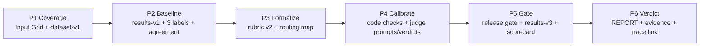

# Hồ sơ bài nộp cá nhân — Tạ Thị Thu Huyền

## Thông tin cá nhân và nhóm

- Họ tên: **Tạ Thị Thu Huyền**.
- MHV/MSSV: **2A202601782**.
- Repo cá nhân khi nộp: `Track1_Day21_2A202601782_TaThiThuHuyen`.
- Nhóm: **VLearn AI Tutor — 3 thành viên**.
- Thành viên: Tạ Thị Thu Huyền, Phạm Hải Yến, Huỳnh Thị Hải Châu
- Eval Pack dùng chung: [deliverables/REPORT.md](deliverables/REPORT.md) và
  [deliverables/evidence/](deliverables/evidence/README.md).

## Phân công cân bằng của nhóm

| Thành viên | Workstream sở hữu chính | Phần chung bắt buộc |
|---|---|---|
| **Huỳnh Thị Hải Châu** | Coverage/dataset và deterministic code gate | Chấm độc lập 30 rows, review chéo và chốt verdict |
| **Tạ Thị Thu Huyền** | Human baseline, rubric semantic và judge calibration | Chấm độc lập 30 rows, review chéo và chốt verdict |
| **Phạm Hải Yến** | Routing, release gate, scorecard và final report | Chấm độc lập 30 rows, review chéo và chốt verdict |

## Sơ đồ sáu phase và artifact

| Phase | Đầu vào | Đầu ra và artifact | Quyết định chính |
|---|---|---|---|
| 1. Coverage | Bài toán VLearn, corpus và rủi ro người dùng | [PHASE-1.md](deliverables/PHASE-1.md), [dataset-v1.jsonl](deliverables/evidence/dataset-v1.jsonl) | Dùng bốn dimension làm thay đổi behavior; giữ risk riêng; thừa nhận 30/30 input là synthetic-reviewed |
| 2. Human baseline | Dataset v1 và output Tutor | [results-v1.jsonl](deliverables/evidence/results-v1.jsonl), ba file label, [agreement-v1.txt](deliverables/evidence/agreement-v1.txt), [labels.csv](deliverables/evidence/labels.csv) | Chấm độc lập trước thảo luận; agreement thật 29/30 = 96%; gold 10 pass/20 fail |
| 3. Formalize & route | Disagreement và failure pattern | Rubric v2 và Routing Map trong [REPORT.md](deliverables/REPORT.md) | Mọi tiêu chí là blocker; code → LLM assist → human, expert chỉ escalation |
| 4. Scale & calibrate | Gold labels, rubric và baseline results | [code-checks-v1.txt](deliverables/evidence/code-checks-v1.txt), các judge prompt/verdict và calibration report trong [evidence](deliverables/evidence/README.md) | Citation deterministic giao code; judge semantic chỉ assist vì Groundedness chạm trần 86% |
| 5. Gate & scorecard | Threshold đóng băng và candidate v3 | [release-gate-v1.md](deliverables/evidence/release-gate-v1.md), [results-v3.jsonl](deliverables/evidence/results-v3.jsonl), [candidate-v3-adjudication.csv](deliverables/evidence/candidate-v3-adjudication.csv), [scorecard-v3.md](deliverables/evidence/scorecard-v3.md) | Không chọn snapshot đẹp hơn; báo cáo đúng v3 là regression run |
| 6. Verdict | Scorecard, slices, regression và trace | Mục 6–7 của [REPORT.md](deliverables/REPORT.md), [braintrust-link.md](deliverables/evidence/braintrust-link.md) | **HOLD**, không cho overall hoặc SLA che blocker quality/scope |

## Đóng góp của tôi

Tôi phụ trách workstream **Human baseline + rubric semantic + judge calibration**:

1. Tạo nhãn độc lập cho đủ 30 rows tại
   [labels-TaThiThuHuyen.csv](data/labels-TaThiThuHuyen.csv), dùng note có prefix
   `pass:`/`fail:` và chỉ rõ blocker.
2. Tổng hợp ba phiếu độc lập bằng `eval/agreement.py`, giữ disagreement `sc-30` trong
   evidence và tham gia chốt gold 10 pass/20 fail; không sửa nhãn để ép agreement.
3. Formalize rubric v2 cho groundedness/completeness, citation và follow-up semantic;
   bổ sung near-miss để người ngoài nhóm cũng áp được cùng chuẩn.
4. Phụ trách hai judge prompt riêng và vòng calibration: đọc confusion matrix,
   TPR/TNR, chỉ sửa một biến prompt mỗi vòng và giữ mọi raw verdict theo version.
5. Chẩn đoán Groundedness v2→v3 cùng 86% agreement nhưng trade TPR/TNR, từ đó đề xuất
   hạ judge xuống **LLM assist + human**; kiểm tra hai judge candidate v3 chạy sau code
   gate, output riêng và không còn 429.

## Verdict của nhóm và vì sao

Nhóm chốt **HOLD / CHƯA SHIP**. Candidate v3 đạt operational gate nhưng chỉ có
**7/30 overall pass**; quote verbatim **19/30**; groundedness **15/30**; follow-up
semantic **26/30**; critical scope **4/6**. Quote, groundedness, follow-up và critical
scope đều là blocker theo ngưỡng đã khóa trước khi xem candidate, nên không đủ điều
kiện `SHIP WITH CONDITIONS`.

## Điều tôi sẽ mang về áp dụng cho dự án thật

Tôi sẽ tạo human baseline độc lập trước khi tự động hóa và luôn giữ disagreement thay
vì che nó bằng một con số agreement đẹp. Khi dùng LLM judge, tôi sẽ theo dõi riêng TPR
và TNR, đọc từng false positive/false negative, version prompt và chỉ thay một yếu tố
mỗi vòng. Nếu judge chạm trần hoặc chưa có held-out negatives, tôi chỉ dùng nó để gom
evidence cho người duyệt chứ không trao quyền quyết định release.

AI Support Log cá nhân: [ai-support-log.md](ai-support-log.md).
